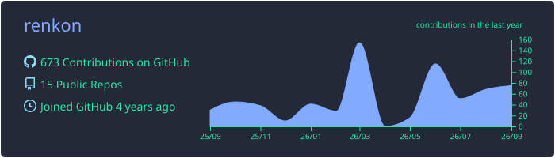
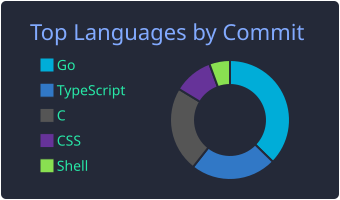
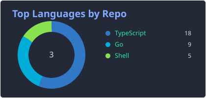
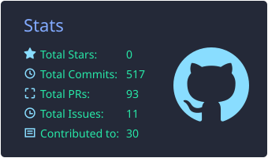
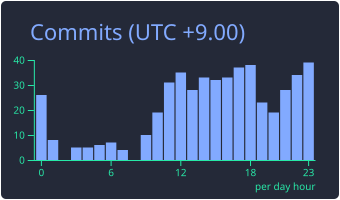

  

### 🎓 Affiliation
- **Science Tokyo** (Institute of Science Tokyo) | B2
- **デジタル創作同好会 traP** ([@traPtitech](https://github.com/traPtitech))

### 🏫 traP の活動
- [traPtitech/manifest](https://github.com/traPtitech/manifest) - Kubernetes manifest管理・インフラ整備
- [traPtitech/traQ](https://github.com/traPtitech/traQ) - traQバックエンドチーム

- VirtualLive - プロジェクト VirtualLive motion技術担当
- traPM - プロジェクト traPM

### 🧰 Tech Stack

  
  
  
  
  

## 📊 Stats

  

  
  

  
  

  

